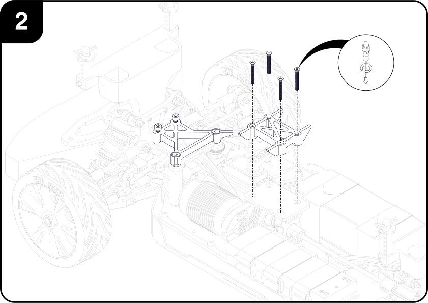
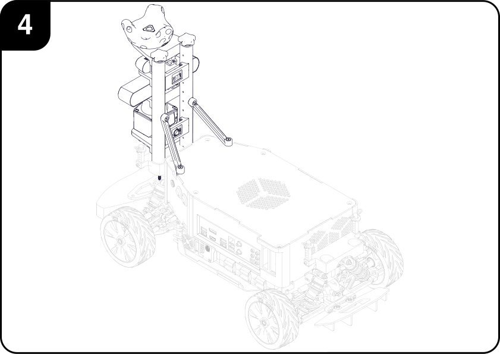

# Car Integration

This page contains the instructions for mounting all the previously assembled subassemblies to the car's structure.

## I. Requirements
### Tools

### Parts

#### Hardware

|        | Description| Qty | 
|:------:|:-----------|:---:|
|| M3x16 CBR | 4 |
|| M3x25 CSK | 4 |
|| M4x25 CBR | 4 |
|| M4x25 CSK | 2 |

# Assembly Steps

### I. Front Sensor Bracket
 
 1. Place the ***Front Sensor Bracket*** to the car's ***Front Suspension Tower***, aligning the mounting holes in both parts.

    
   
 2. Attach the ***Front Sensor Bracket*** to the car's ***Front Suspension Tower*** from the front using the car's original two *M3x12 Buttonhead* screws.

    
   
 3. Attach the ***Front Sensor Bracket*** to the car's ***Front Suspension Tower*** from the back using two *M3x16 Socket head* screws.

    
   
 4. Final placement.

    

    
## II. Rear Sensor Bracket
 
 1. Align the ***Rear Sensor Bracket*** to the car's ***Rear Suspension Tower***.

    
   
 2. Screw the ***Rear Sensor Bracket*** to the car's ***Rear Suspension Tower*** from the back using the car's original two *M3x12 Buttonhead* screws.

    
   
 3. Fasten two *M3x16 Socket head* screws to the ***Rear Sensor Bracket*** from the front.

    
   
 4. Final placement.

    

## III. Bottom Spacers
 
 1. Attach the ***Front Bottom Spacer*** to the plastic ***Buffer Plate*** of the car's suspension subassembly using two *M4x25 Countersunk* and two *M4x25 Socket Head* screws as shown in the picture. Make sure to leave a gap slightly larger than 3mm between the socket head screws and the spacer to allow the key slots of the PC to slide in easily.

    
   
 2. Attach the ***Center Bottom Spacer*** to the ***Transmission Plate*** of the car's solid axle subassembly using four *M3x25 Countersunk* screws.

    
   
 3. Attach the ***Rear Bottom Spacer*** to the ***Rear Axis Stiffener Mount*** of the car's rear differential subassembly using two *M4x25 Countersunk* screws. Just as in step 1), make sure to leave a gap slightly larger than 3mm between the screws and the spacer to allow the key slots of the PC to slide in easily.

    
   
 4. Final placement.

    

## IV. PC and Motor Driver
 
 1. Attach the ***Motor Driver*** subassembly by inserting and sliding the top screws into the corresponding key slots at the bottom of the ***PC***. Once in place, the screws can be tightened for a more secure attachment during normal operation.

    
   
 2. Attach the ***PC*** and ***Motor Driver*** subassembly to the car by inserting and sliding its key slots to the socket head screws from the ***Bottom Spacers***. Once in place, the screws can be tightened for a more secure attachment during normal operation.

    

## V. Front Sensor Array
 
 1. Attach the ***Front Sensor Array*** subassembly by sliding the vertical posts into the corresponding bosses from the ***Front Sensor Bracket***.

    
   
 2. Insert the *M4x270* threaded rods through the vertical posts holes and tighten them using the knobs. 

    
   
 3. Rotate the angled *Braces* so that they become attached to corresponding slots at the top of the ***PC*** case by means of the ***Brace Nuts***. Tighten the screws on the braces for a more rigid assembly.

    
   
 4. Final Placement.

    

## VI. Rear Sensor Array
 
 1. Attach the ***Rear Sensor Array*** subassembly by sliding the vertical posts into the corresponding bosses from the ***Rear Sensor Bracket***.

    
   
 2. Insert the *M4x135* threaded rods through the vertical posts holes and tighten them using the knobs.

    
   
 3. Final placement.

    
   