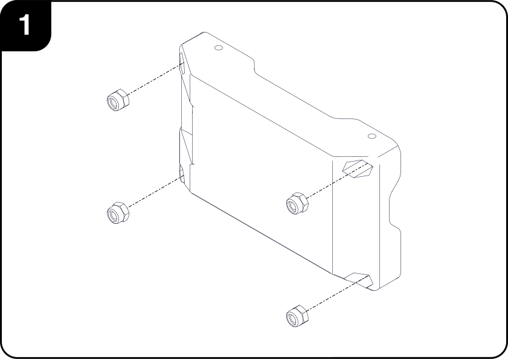
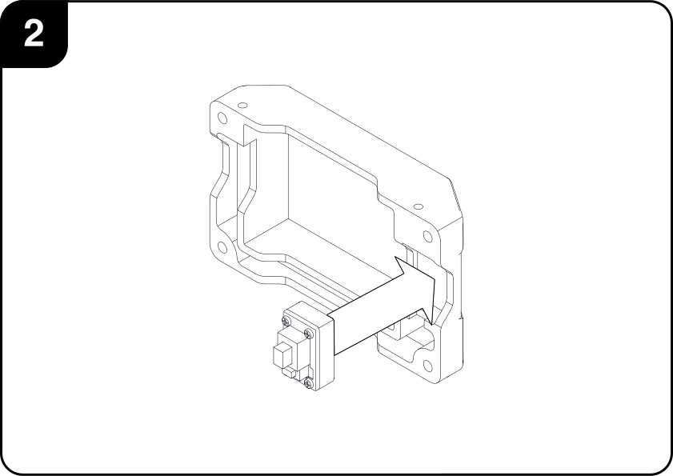
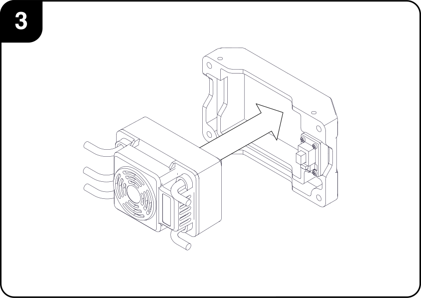
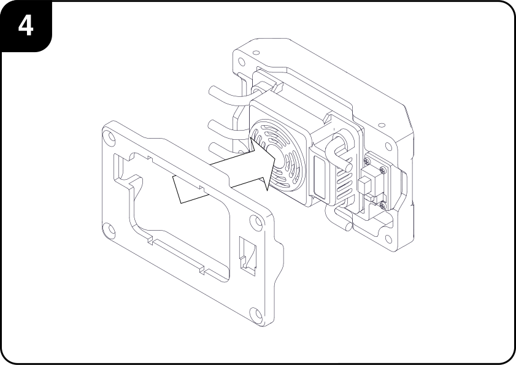
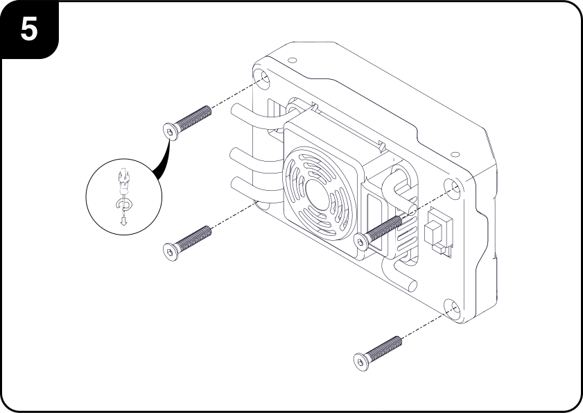
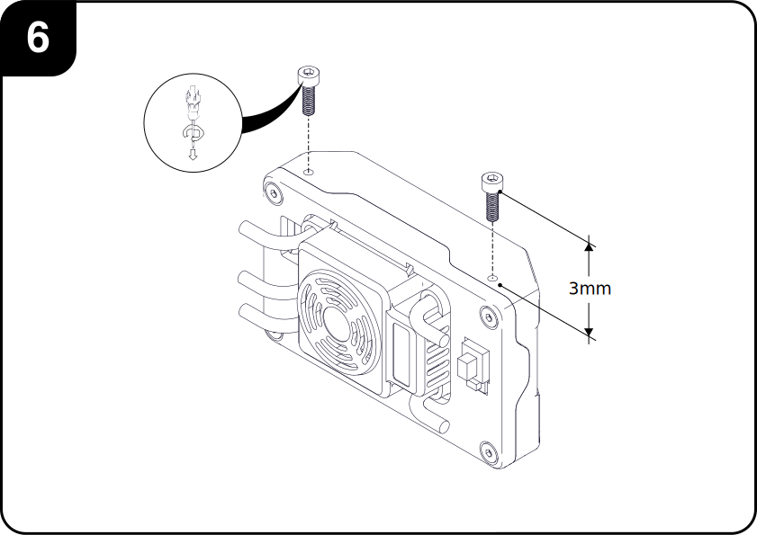

# ESC Case

This page contains the instructions for assembling the car's Electronic Speed Controller Case.

This sub-assembly is used for protecting the ESC and providing mounting features, while keeping the power switch and RC synchronization button easily accessible during normal operation.

## I. Requirements
### Tools

|        | Description| 
|:------:|:-----------|
|| 2 and 2.5mm Hex Driver     |

### Parts

#### Hardware

|        | Description| Qty | 
|:------:|:-----------|:---:|
|| M3x16 CSK     | 4 |
|| M3x10 CBR     | 2 |
|   | M3 Nyloc Nuts | 4 |

#### Custom Parts

|        | Description| Qty | 
|:------:|:-----------|:---:|
|| ESC Case                    | 1 |
|  | ESC Case Lid                | 1 |

#### GRL8 Scale Car Parts
|        | Description| Qty | 
|:------:|:-----------|:---:|
|  | Electronic Speed Controller | 1 |
|| ESC Power Switch            | 1 |

## II. Assembly Steps

 
 
1. Insert the four *M3 Nyloc nuts* in their respective holes at the back of the ***ESC Case***.

    

2. Place the ***ESC Power Switch*** in its position at the front of the ***ESC Case***. It should fit snuggly, without needing too much insertion force.

    

3. Place the ***ESC*** in its position at the front of the ***ESC Case*** and route the ***Switch***'s cable through the groove at the bottom of the ***Case***.  

    

4. Close the ***ESC Case*** with the ***ESC Case Lid***, making sure to pass the power and motor cables through the main opening.

     

5. Secure the ***Lid*** to the ***Case*** using the four *M3x16 Countersunk* screws.

      
 
6. Screw the two *M3x10 Counterbore* screws to the top of the case. This screws are used to mounting the driver assembly to the bottom of the ***PC Case*** via keyholes, thus, a gap of about *3mm* should be left between the head of the screws and the top of the case. 

     
     
     
## III. Exploded View

#### BOM

| ID    | Description                | Qty |
|:-----:|:---------------------------|:---:|
| **1** |ESC Case                    | 1   |
| **2** |ESC Case Lid                | 1   |
| **3** |Electronic Speed Controller | 1   |
| **4** |ESC Power Switch            | 1   |
| **5** |M3 Nyloc Nuts               | 4   |
| **6** |M3x10 CBR Screws            | 2   |
| **7** |M3x16 CSK Screws            | 4   |
 