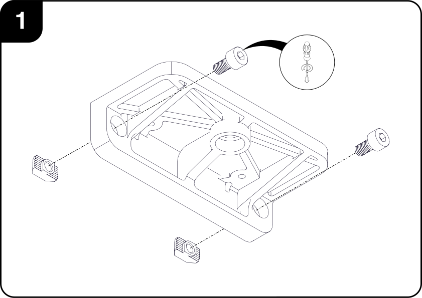

# Front Sensor Array

This subassembly contains the main, forward-facing sensors used by the car for object and environmental detection.

## I. Requirements
### Tools

|        | Description| 
|:------:|:-----------|
|| 2.0mm  Hex Driver,   2.5mm  Hex Driver,  3.0mm  Hex Driver,  3/8"  Hex Driver     |
|| Soldering Iron     |
|| Cyanoacrilate, Two-part Epoxy or Silicon Glue     |

### Parts

#### Hardware

|                                                  | Description                | Qty |   |                                                  | Description                | Qty |
|:------------------------------------------------:|:---------------------------|:---:|---|:------------------------------------------------:|:---------------------------|:---:|
|    |M2.5x16 CBR Screws          | 2   |   |           |M3 Nuts                     | 4   |
|        |M3x8 CSK Screws             | 16  |   |           |M3 Nyloc Nuts               | 2   |
|        |M3x10 CSK Screws            | 2   |   |           |M4 Nuts                     | 4   |
|        |M3x12 CSK Screws            | 2   |   |           |M4 Nuts                     | 4   |
|        |M4x10 CBR Screws            | 21  |   |           |M4x6 T-Nuts                 | 8   |
||1/4"-20x1/2" CBR Screws     | 3   |   |                                                  |                            |     |

#### Custom Parts

|                                                            | Description          | Qty |   |                                                       | Description                | Qty |
|:----------------------------------------------------------:|:---------------------|:---:|---|:-----------------------------------------------------:|:---------------------------|:---:|
|        | Sensor Vertical Rail | 2   |   |       | Hand Knob                  | 2   |
|| Rail Horizontal Brace| 2   |   |    | Sick Bracket               | 1   |
|           | Left Brace           | 1   |   |  | Camera Bracket             | 2   |
|          | Right Brace          | 1   |   || Camera Bracket Back Support| 2   |
|            | Brace Nut            | 2   |   |    | Vive Bracket               | 1   |

#### Commercial Components
|                                                    | Description                        | Qty |
|:--------------------------------------------------:|:-----------------------------------|:---:|
|  | Sick TIM55x Ranging Laser Scanner  | 1   |
|      | ZED Stereo camera                  | 1   |
|  | Intel RealSense Depth Camera D435i | 1   |
| | HTC Vive Tracker                   | 1   |

## II. Assembly Steps

### II.1 Array Screws

1. Insert one *M4 Nut* on one end of the *M4x270* and use another *M4 Nut* to jam it in place so as to prevent them moving. Up to 5mm of thread can be left after the nuts. Repeat this step for the second screw.  

    
   
 2. Attach the ***Hand Knob*** to the threaded rod using some glue, preferrably two-part epoxy, but silicone or cyanoacrylate based ones should work as well. Make sure that the hexagonal faces of the outermost nut engage properly with those in the *Hand Knob* and that it is seated as deeply as possible. Repeat this step for the second screw.

    
   
 3. Final assembly. Let the glue fully cure according to the manufacturer's instructions before applying any forces to the screws.

    

### II.2 Mounting Bracket

1. Insert two *M4 Nyloc Nuts* into the respective holes as shown in the picture. Use some form of glue to preventing from falling out when attaching or removing the screws.

    
   
 2. Insert two *M3 Nyloc Nuts* into the respective holes as shown in the picture. Optionally, use glue to affix them in place, though it is less likely that they will fall out.

    
   
 3. Insert the GR8LE's ***Body Columns*** into their respective square bosses. Screw them in place using the car's original *M2.5x16 CBR* screws using the bottom holes from the columns. 

    
    
 4. Final assembly. Let the glue fully cure according to the manufacturer's instructions before applying any forces to the assembly.

    

### II.3 Vertical Rails

 1. Using a soldering iron, place the *M3 Brass Threaded Inserts* into the ***Sensor Vertical Rail***, leaving it flush with the top surface. Repeat for the second rail. 

    
   
 2. Fasten the ***Horizontal Rail Braces*** to one of the ***Vertical Sensor Rails*** using four *M4x10 Socket Head* screws.

    
   
 3. Using another four *M4x10 Socket Head* screws, fasten the second ***Vertical Sensor Rail*** to the previous subassembly.

    
    
 4. Attach the ***Left*** and ***Right*** Braces to the subassembly using two *M3x8 Countersunk* screws.

    
 
 5. Insert the ***Brace Nuts*** into the ***Braces***, making sure that the hexagonal faces are aligned, and secure them using two *M3x12 Countersunk* screws. Leave a gap between the bottom face of the brace and the flange of the nut of about 3.5mm for an easier installation on the ***PC Case*** later. 

    
    
 6. Final assembly.

    

### II.4 Vive Tracker Bracket

 1. Attach two ***M4x10 Socket Head Screws*** and two ***M4x6 Tee Nuts*** to the ***Vive Tracker Bracket***, leaving them loose for easy insertion and removal from the ***Rail*** Subassembly.

    
   
 2. Screw an ***M4x10 Socket Head Screw*** into any of the six holes of the ***Vive Tracker Bracket***.
 The purpose of this screw is to prevent the rotation of the ***Tracker***, and its position determines the angular orientation of the tracker with respect to the rest of the car.
 The recommended position shown in the picture is so that the *z* axis of the ***Tracker*** is pointing towards the front of the car.

    
   
 3. Secure the ***Vive Tracker*** to the ***Bracket*** using a *1/2"-20x0.500" Socket Head* Screw, making sure to also align the screw from the previous step with the *Stabilizing Pin Recess** on the bottom of the ***Tracker***.

    
    
 4. Final assembly.

    

### II.5 Intel Camera Bracket

 1. Attach two ***M4x10 Socket Head Screws*** and two ***M4x6 Tee Nuts*** to the ***Camera Bracket***, leaving them loose for easy insertion and removal from the ***Rail*** Subassembly.

    
   
 2. Mount the ***Camera Bracket Back Support*** to the ***Camera Bracket's*** front holes using two *M3x8 Countersunk Screws*.

    
   
 3. Secure the ***Intel RealSense Camera*** to the ***Bracket*** using a *1/2"-20x0.500" Socket Head* Screw.

    
    
 4. Optionally, secure the ***Camera*** to the ***Back Support*** using two *M3x8 Countersunk* screws.

    
 
 5. Final assembly.

    
    
### II.6 ZED Camera Bracket

 1. Attach two ***M4x10 Socket Head Screws*** and two ***M4x6 Tee Nuts*** to the ***Camera Bracket***, leaving them loose for easy insertion and removal from the ***Rail*** Subassembly.

    
   
 2. Mount the ***Camera Bracket Back Support*** to the ***Camera Bracket's*** rear holes using two *M3x8 Countersunk Screws*.

    
   
 3. Secure the ***ZED Camera*** to the ***Bracket*** using a *1/2"-20x0.500" Socket Head* Screw.

    
    
 4. Final assembly.

    

### II.7 SICK Scanner Bracket

 1. Attach two ***M4x10 Socket Head Screws*** and two ***M4x6 Tee Nuts*** to the ***SICK Bracket***, leaving them loose for easy insertion and removal from the ***Rail*** Subassembly.

    
   
 2. Mount the ***Sick Ranging Laser Scanner*** to the ***Bracket*** using two *M3x8 Countersunk* screws. 

    
   
 3. Final Assembly.

    
    
### II.8 Final Assembly

1. Slide each of the sensor brackets into their desired position, making sure that the *Tee Nuts* are engaging properly with the T-Slots. Once satisfied with their positioning, tighten all of the *M4x8 Socket Head* screws holding them in place.

    
   
 2. Final –proposed– assembly.

    

## III. Exploded View

### III.1 Mounting Bracket

#### BOM

| ID     | Description                     | Qty |
|:------:|:--------------------------------|:---:|
|  **1** |Front Sensor Bracket             | 1   |
|  **2** |Body Columns                     | 2   |
|  **3** |M2.5x16 CBR Screws               | 2   |
|  **4** |M3x10 CSK Screws                 | 2   |
|  **5** |M3 Nyloc Nuts                    | 2   |
|  **6** |M4 Nyloc Nuts                    | 2   |

### III.2 Sensor Array

#### BOM

| ID     | Description                     | Qty |     | ID     | Description                      | Qty |
|:------:|:--------------------------------|:---:|:---:|:------:|:--------------------------------:|:---:|
|  **1** |Sensor Vertical Rail             | 2   |     | **13** |Intel RealSense Depth Camera D435i| 1   |
|  **2** |Horizontal Rail Brace            | 2   |     | **14** |Vive Tracker Bracket              | 1   |
|  **3** |Left Brace                       | 1   |     | **15** |HTC Vive Tracker                  | 1   |
|  **4** |Right Brace                      | 1   |     | **16** |M3x8 CSK Screws                   | 16  |
|  **5** |Brace Nut                        | 2   |     | **17** |M3x12 CSK Screws                  | 2   |
|  **6** |Hand Knob                        | 2   |     | **18** |M4x10 CBR Screws                  | 21  |
|  **7** |M3x270 Threaded Rod              | 2   |     | **19** |1/4"-20x1/2" CBR Screws           | 3   |
|  **8** |Sick Bracket                     | 1   |     | **20** |M3 Nuts                           | 4   |
|  **9** |Sick TIM55x Ranging Laser Scanner| 1   |     | **21** |M4 Nuts                           | 4   |
| **10** |Camera Bracket                   | 2   |     | **22** |M4x6 Tee Nuts                     | 8   |
| **11** |Camera Bracket Back Support      | 2   |     | **23** |M4 Brass Threaded Insert          | 2   |
| **12** |ZED Stereo Camera                | 1   |

