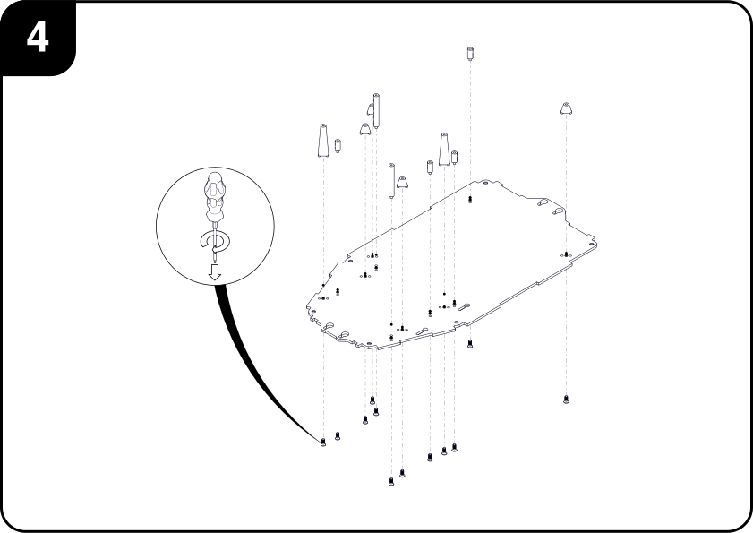

# PC Case

The purpose of this subassembly is to encase the major electronic components used for the FreiCar, provide protection from environmental hazards such as dust and moisture, and allow some degree of cable management.

## I. Requirements
### Tools

### Parts

#### Hardware

|                                          | Description                | Qty | 
|:----------------------------------------:|:---------------------------|:---:|
||M3x6 CBR Screws             | 12  |
||M3x8 CSK Screws             | 12  |
||M4x12 CSK Screws            | 12  |

#### Custom Parts

|                                                    | Description         | Qty |   |                                                    | Description         | Qty |
|:--------------------------------------------------:|:--------------------|:---:|---|:--------------------------------------------------:|:--------------------|:---:|
|     | Case Bottom         | 1   |   |         | Case Left           | 1   |
|     | Case Corner 90º     | 1   |   |       | Case Right          | 1   |
|     | Case Corner PCI     | 1   |   | | Case Front-Left     | 1   |
|| Case Corner Angle 1 | 2   |   |  | Case Back-Left      | 1   |
|| Case Corner Angle 2 | 2   |   |           | Case Top            | 1   |
|       | Case Front          | 1   |   | | Standoff 10 mm      | 8   |
|         | Case Back           | 1   |   | | Standoff 40 mm      | 4   |
|      | Car Interface Board | 1   |   |                                                    |                     |     |

#### Commercial Components
|                                                    | Description         | Qty |
|:--------------------------------------------------:|:--------------------|:---:|
|     | Toggle Switch w/ LED| 2   |
|   | DC Power Jack       | 1   |
|             | Mini-ITX PC         | 1   |
| | PC Port Plate       | 1   |
|           | M4-ATX Power Supply | 1   |

## II. Assembly Steps

1. Insert the ***DC Power Jack*** and the ***Motor*** and ***PC switches*** in their respective holes in the
***Front-Left case*** side.

    

2. Attach the case's ***Front Panel*** to the ***PCI corner*** piece with care, since the thin tine that divides the PCI
card slots can be very fragile. Then proceed to attach an ***Angle 1*** corner to the other end of the ***Front Panel***.

    

3. Place the ***PC's Port Cover*** in the ***Front Panel***'s opening from the inside.  

    

4. Using the *M3x8 Countersunk screws*, attach all of the ***Standoffs*** to the ***Bottom Plate*** as shown in the
picture.

     

5. Place the Front Panel, assembled in step **(3)**, along with the remaining ***Corner Pieces*** in their respective
positions on the ***Bottom Plate*** and secure them with *M4x12 Countersunk screws*.

      
 
6. Position the assembled PC on top of the four ***10mm Standoffs***, by sliding it horizontaly so that the ports end in
their respective cutouts in the ***Port Cover***, and fasten it using four *M3x6 Cap screws*.
**(Note:** If a PCI card is attached to the motherboard, it may be blocking the access to one of the mounting holes. If that is the
case, detach the PCI card before screwing the motherboard to the base, and reattach it after the mounting screws have
been tightened.**)**

     

7. Affix the ***Car Interface Board*** to the ***10 mm Standoffs*** on the bottom plate using four *M3x6 Cap screws*.
It is a good idea to connect and arrange all the necessary cables to the PCB at this stage, since it will be covered in
the next step.

    
    
8.  Place the ***Power Supply Circuit*** on top of the longer ***40 mm Standoffs*** and secure it in place with four
*M3x6 Cap screws*. Finish all of the internal cabling and routing.

    

9. Slide the remaining ***Side Panels*** into their respective grooves.

    
   
10. Screw the ***Top Plate*** to the ***Corner Pieces*** using 6 *M4x12 Countersunk screws*.
    
    

## III. Exploded View

#### BOM

| ID     | Description                | Qty |     | ID     | Description                | Qty |
|:------:|:---------------------------|:---:|:---:|:------:|:---------------------------|:---:|
|  **1** |Case Bottom                 | 1   |     | **13** |Standoff 10 mm              | 8   |
|  **2** |Case Corner 90º             | 1   |     | **14** |Standoff 40 mm              | 4   |
|  **3** |Case Corner PCI             | 1   |     | **15** |Toggle Switch w/LED         | 2   |
|  **4** |Case Corner Angle 1         | 2   |     | **16** |DC Power Jack               | 1   |
|  **5** |Case Corner Angle 2         | 2   |     | **17** |Mini-ITX PC                 | 1   |
|  **6** |Case Front                  | 1   |     | **18** |PC Port Plate               | 1   |
|  **7** |Case Back                   | 1   |     | **19** |M4-ATX Power Supply         | 1   |
|  **8** |Case Left                   | 1   |     | **20** |Car Interface Board         | 1   |
|  **9** |Case Right                  | 1   |     | **21** |M3x6 CBR Screws             | 12  |
| **10** |Case Front Left             | 1   |     | **22** |M3x8 CSK Screws             | 12  |
| **11** |Case Front Right            | 1   |     | **23** |M4x12 CSK Screws            | 12  |
| **12** |Case Top                    | 1   |     |        |                            |     |

