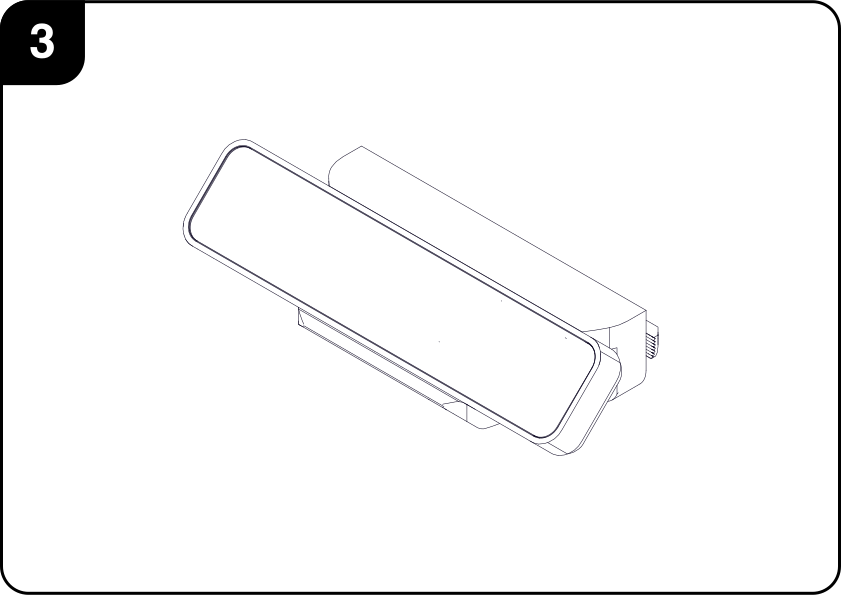

# Rear Sensor Array

This subassembly contains the rear-facing sensors used by the car for localization or other tasks.

## I. Requirements
### Tools

|        | Description| 
|:------:|:-----------|
|| 2.0mm  Hex Driver,   2.5mm  Hex Driver,  3.0mm  Hex Driver     |
|| Cyanoacrilate, Two-part Epoxy or Silicon Glue     |

### Parts

#### Hardware

|                                                  | Description                | Qty |   |                                                  | Description                | Qty |
|:------------------------------------------------:|:---------------------------|:---:|---|:------------------------------------------------:|:---------------------------|:---:|
|    |M2.5x16 CBR Screws          | 2   |   |           |M3 Nyloc Nuts               | 2   |
|        |M3x8 CSK Screws             | 2   |   |           |M4 Nuts                     | 4   |
|        |M3x16 CSK Screws            | 2   |   |           |M4 Nyloc Nuts               | 2   |
|        |M4x10 CBR Screws            | 6   |   |           |M4x6 T-Nuts                 | 2   |

#### Custom Parts

|                                                            | Description          | Qty |   |                                                       | Description                | Qty |
|:----------------------------------------------------------:|:---------------------|:---:|---|:-----------------------------------------------------:|:---------------------------|:---:|
|         | Sensor Vertical Rail | 2   |   |       | Hand Knob                  | 2   |
|| Rail Horizontal Brace| 2   |   || Tracking Camera Bracket    | 1   |

#### Commercial Components
|                                                 | Description                          | Qty |
|:-----------------------------------------------:|:-------------------------------------|:---:|
| | Intel RealSense Tracking Camera T265 | 1   |

## II. Assembly Steps

### II.1 Array Screws

1. Insert one *M4 Nut* on one end of the *M4x135* and use another *M4 Nut* to jam it in place so as to prevent them moving. Up to 5mm of thread can be left after the nuts. Repeat this step for the second screw.  

    
   
 2. Attach the ***Hand Knob*** to the threaded rod using some glue, preferrably two-part epoxy, but silicone or cyanoacrylate based ones should work as well. Make sure that the hexagonal faces of the outermost nut engage properly with those in the ***Hand Knob*** and that it is seated as deeply as possible. Repeat this step for the second screw.

    
   
 3. Final assembly. Let the glue fully cure according to the glue manufacturer's instructions before applying any forces to the screws.

    

### II.2 Mounting Bracket

1. Insert two *M4 Nyloc Nuts* into the respective holes as shown in the picture. Use some form of glue to preventing from falling out when attaching or removing the screws.

    
   
 2. Insert two *M3 Nyloc Nuts* into the respective holes as shown in the picture. Optionally, use glue to affix them in place, though it is less likely that they will fall out.

    
   
 3. Insert the GR8LE's ***Rear Body Columns*** into their respective square bosses. Screw them in place using the car's original *M2.5x16 CBR* screws using the bottom holes from the columns. 

    
    
 4. Final assembly. Let the glue fully cure according to the glue manufacturer's instructions before applying any forces to the assembly.

    

### II.3 Vertical Rails

 1. Fasten the ***Horizontal Rail Brace*** to one of the ***Rear Vertical Sensor Rails*** using two *M4x10 Socket Head* screws.

    
   
 2. Using another two *M4x10 Socket Head* screws, fasten the second ***Rear Vertical Sensor Rail*** to the previous subassembly.

    
   
 3. Final assembly.

    

### II.4 Intel Tracking Camera Bracket

 1. Attach two ***M4x10 Socket Head Screws*** and two ***M4x6 Tee Nuts*** to the ***Intel Tracking Camera Bracket***, leaving them loose for easy insertion and removal from the ***Rail*** Subassembly.

    
   
 2. Mount the ***Intel RealSense Tracking Camera T265*** to the ***Bracket*** using two *M3x8 Countersunk* screws.

    
   
 3. Final assembly.

    
    

### II.5 Final Assembly

 1. Slide each of the sensor brackets into their desired position, making sure that the *Tee Nuts* are engaging properly with the T-Slots. Once satisfied with their positioning, tighten all of the *M4x8 Socket Head* screws holding them in place.

    
   
 2. Final –proposed– assembly.

    

## III. Exploded View

### III.1 Mounting Bracket

#### BOM

| ID     | Description                     | Qty |
|:------:|:--------------------------------|:---:|
|  **1** |Rear Sensor Bracket              | 1   |
|  **2** |Rear Body Columns                | 2   |
|  **3** |M2.5x16 CBR Screws               | 2   |
|  **4** |M3x16 CSK Screws                 | 2   |
|  **5** |M3 Nyloc Nuts                    | 2   |
|  **6** |M4 Nyloc Nuts                    | 2   |

### III.2 Sensor Array

#### BOM

| ID     | Description                         | Qty |     | ID     | Description                      | Qty |
|:------:|:------------------------------------|:---:|:---:|:------:|:--------------------------------:|:---:|
|  **1** |Rear Sensor Vertical Rail            | 2   |     | **7**  |M3x8 CSK Screws                   | 2   |
|  **2** |Horizontal Rail Brace                | 1   |     | **8**  |M4x10 CBR Screws                  | 2   |
|  **3** |Hand Knob                            | 2   |     | **9**  |M4x135 Threaded Rod               | 2   |
|  **4** |Tracking Camera Bracket              | 1   |     | **10** |M4 Nuts                           | 4   |
|  **5** |Intel RealSense Tracking Camera T265 | 1   |     | **11** |M4x6 Tee Nuts                     | 2   |
|  **6** |M4x10 CBR Screws                     | 4   |     |        |                                  |     |

